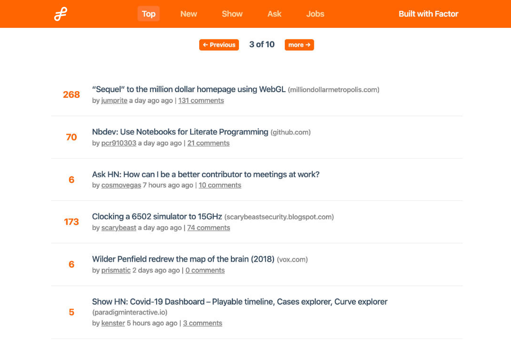

# factor-hacker-news

HackerNews clone built with Factor. Includes framework features(router, store,
etc) and demonstrates server rendering.

<p align="center">
  <a href="https://hacker-news-example.factor.dev" target="_blank">
    
    <br>
    Live Demo
  </a>
</p>

## Features

- Uses flat store + cache with `stored` and `storeItem` items
- Supports multiple views and routes
- Complete Vue SSR framework
- Real-time updating with animation

## Docs and Architecture Overview

**Factor docs can be found [here](https://factor.dev).**

## Build Setup

**Requires Node.js LTS+**

```bash
# install dependencies
npm install # or yarn

# serve in dev mode, with hot reload at localhost:8080
npm run dev

# build for production
npm run build

# serve in production mode
npm start
```

## License

MIT
